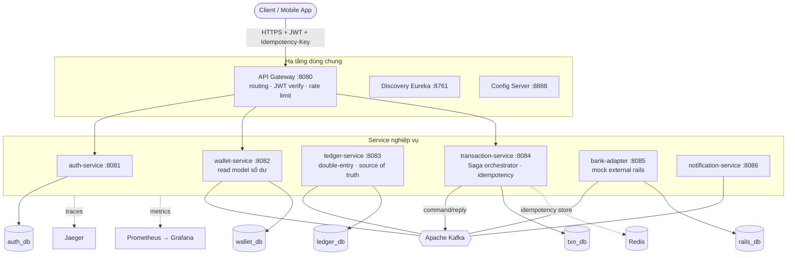
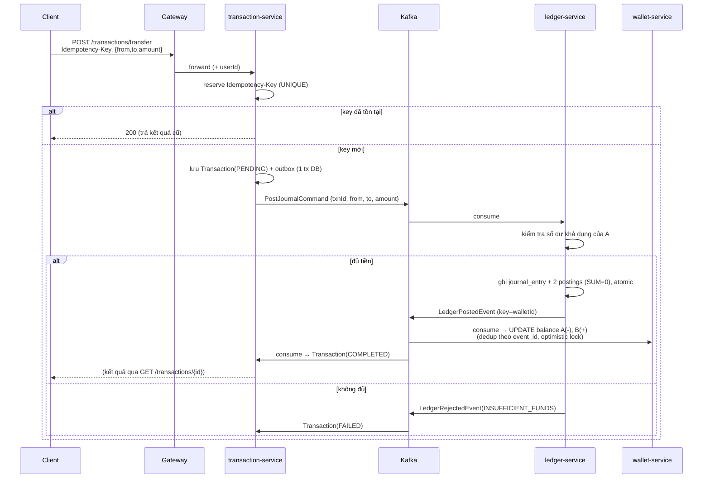
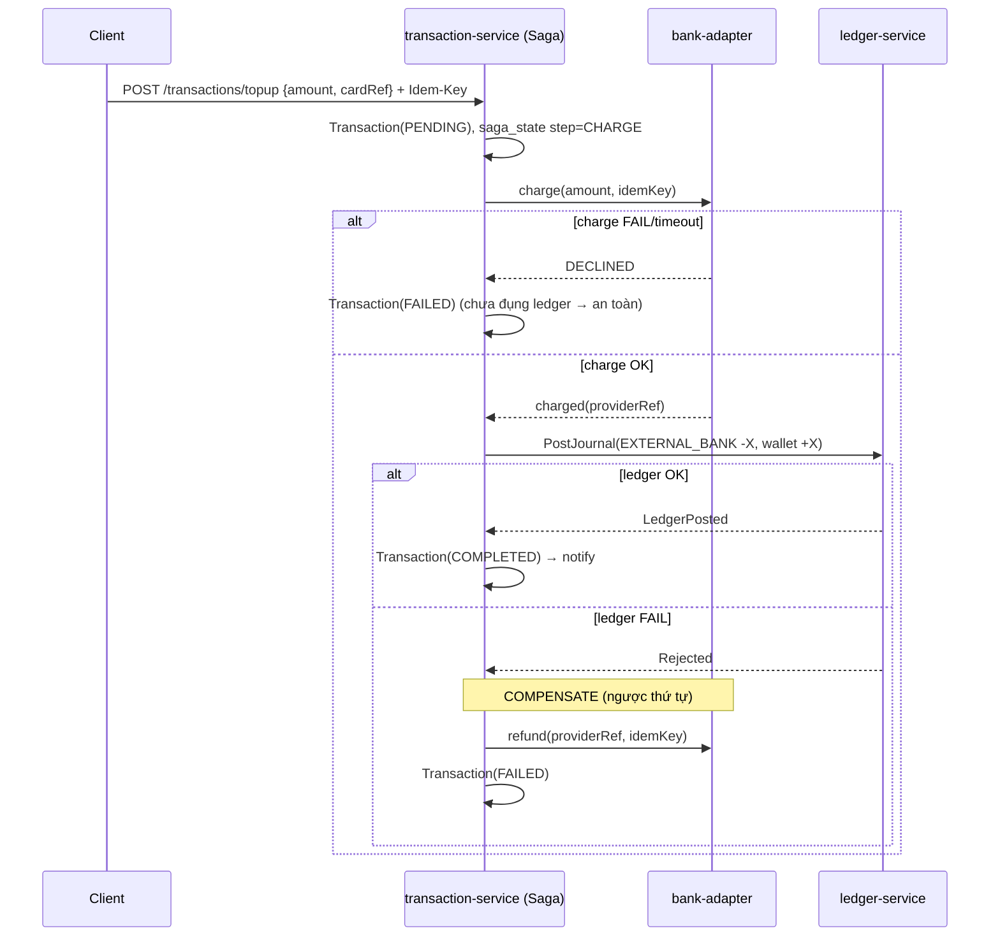
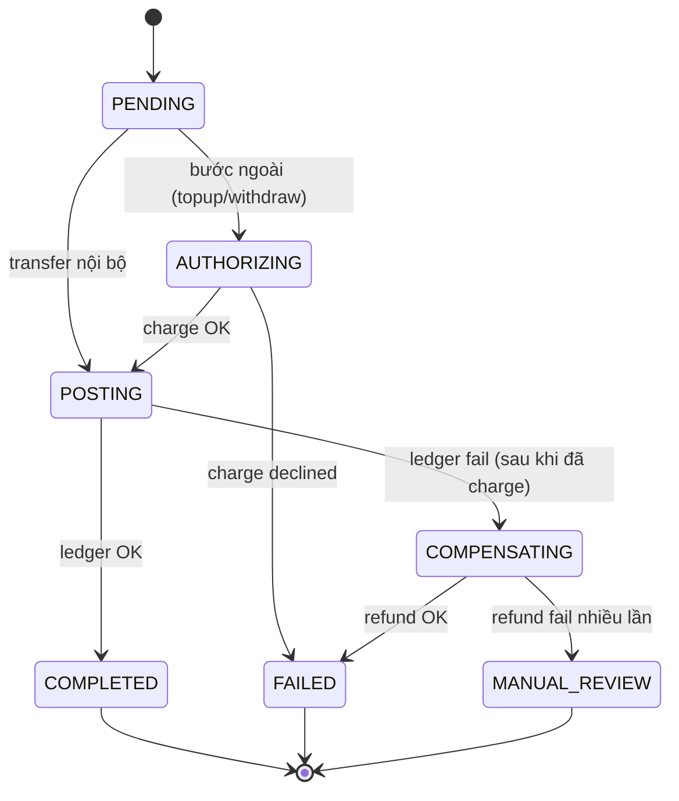

# WalletFlow — Kế hoạch triển khai hệ thống Ví điện tử Microservices

> **Pitch 1 dòng (dùng cho CV):** *Distributed digital-wallet platform — double-entry ledger, idempotent money movement, Saga-orchestrated top-up/withdraw across an external bank adapter, at-least-once Kafka with consumer dedup, verified end-to-end with Testcontainers.*

**Trạng thái:** Bản kế hoạch (chưa code) · **Ngày:** 2026-08-12 · **Nền tảng:** Java 21, Spring Boot 3.5, Spring Cloud 2025, PostgreSQL, Kafka, Redis

---

## Mục lục

1. [Triết lý & các bài toán khó cần giải](#1-triết-lý--các-bài-toán-khó-cần-giải)
2. [Phạm vi nghiệp vụ & Bounded Context](#2-phạm-vi-nghiệp-vụ--bounded-context)
3. [Kiến trúc tổng thể](#3-kiến-trúc-tổng-thể)
4. [Danh mục service (chi tiết)](#4-danh-mục-service-chi-tiết)
5. [Thiết kế dữ liệu — Double-entry Ledger](#5-thiết-kế-dữ-liệu--double-entry-ledger)
6. [Biểu diễn tiền tệ (Money) — làm đúng ngay từ đầu](#6-biểu-diễn-tiền-tệ-money--làm-đúng-ngay-từ-đầu)
7. [Các bài toán khó & lời giải](#7-các-bài-toán-khó--lời-giải)
8. [Luồng nghiệp vụ chính + Sequence Diagram](#8-luồng-nghiệp-vụ-chính--sequence-diagram)
9. [State machine của giao dịch & Saga](#9-state-machine-của-giao-dịch--saga)
10. [Thiết kế API](#10-thiết-kế-api)
11. [Thiết kế event & Kafka topic](#11-thiết-kế-event--kafka-topic)
12. [Khả năng phục hồi (Resilience) & xử lý lỗi](#12-khả-năng-phục-hồi-resilience--xử-lý-lỗi)
13. [Observability](#13-observability)
14. [Bảo mật & tuân thủ](#14-bảo-mật--tuân-thủ)
15. [Chiến lược kiểm thử](#15-chiến-lược-kiểm-thử)
16. [CI/CD](#16-cicd)
17. [Triển khai (Docker → Kubernetes)](#17-triển-khai-docker--kubernetes)
18. [Yêu cầu phi chức năng & SLO](#18-yêu-cầu-phi-chức-năng--slo)
19. [Migration & tiến hoá schema](#19-migration--tiến-hoá-schema)
20. [Lộ trình theo giai đoạn (milestones)](#20-lộ-trình-theo-giai-đoạn-milestones)
21. [Cấu trúc thư mục](#21-cấu-trúc-thư-mục)
22. [Tech stack đầy đủ](#22-tech-stack-đầy-đủ)
23. [Điểm nhấn CV & câu hỏi phỏng vấn](#23-điểm-nhấn-cv--câu-hỏi-phỏng-vấn)
24. [Chỉ mục ADR](#24-chỉ-mục-adr)

---

## 1. Triết lý & các bài toán khó cần giải

Mục tiêu **không** phải là làm nhiều tính năng. Mục tiêu là chọn **ít nghiệp vụ nhưng ép hệ thống phải giải những bài toán khó, phổ biến trong thực tế** — những thứ phân biệt kỹ sư "code chạy được" với kỹ sư "hiểu hệ thống phân tán".

Danh sách bài toán hệ thống này **cố tình** buộc phải giải:

| # | Bài toán thực tế | Vì sao khó | Giải ở mục |
|---|---|---|---|
| P1 | **Dual-write** (ghi DB + phát event) không nguyên tử | Crash giữa 2 bước → mất event hoặc event ma | §7.1 Outbox |
| P2 | **Double-charge khi client retry** | Mạng timeout, client gửi lại → trừ tiền 2 lần | §7.2 Idempotency |
| P3 | **Lost update** khi 2 giao dịch cùng ví chạy song song | Read-modify-write đè nhau → sai số dư | §7.3 Concurrency |
| P4 | **Distributed transaction** không có 2PC | Chuyển tiền qua nhiều service/DB, cần all-or-nothing | §7.4 Saga |
| P5 | **Kafka at-least-once** → consumer nhận trùng | Rebalance/retry làm message lặp | §7.5 Dedup |
| P6 | **Số dư âm / bán quá quỹ** | Kiểm tra số dư rồi trừ, giữa 2 bước có race | §7.3 + §7.6 |
| P7 | **Tiền bị "bốc hơi" / tự sinh** | Bug làm tổng tiền hệ thống không bảo toàn | §5 Ledger + §7.7 Reconciliation |
| P8 | **Float làm sai tiền** (0.1 + 0.2 ≠ 0.3) | Dùng double cho tiền | §6 Money |
| P9 | **Poison message** làm kẹt cả partition | 1 message lỗi retry vô hạn | §12 DLQ |
| P10 | **Message đến sai thứ tự** | Kafka chỉ đảm bảo thứ tự trong 1 partition | §11 Partition key |
| P11 | **Không biết vì sao request chậm/lỗi** | Trace nằm rải rác 6 service | §13 Tracing |
| P12 | **Cascading failure** khi 1 service chết | Gọi đồng bộ chờ timeout → sập dây chuyền | §12 Circuit breaker |

Nếu giải trọn vẹn 12 bài toán trên, đây đã là một hệ thống **production-like** thật sự, không phải demo.

---

## 2. Phạm vi nghiệp vụ & Bounded Context

Chỉ **3 luồng tiền**, nhưng đủ để chạm hết 12 bài toán:

1. **Top-up (Nạp tiền):** Ngân hàng/thẻ ngoài → Ví. *(Saga có bước gọi hệ thống ngoài có thể fail)*
2. **Transfer P2P (Chuyển tiền):** Ví A → Ví B trong hệ thống. *(Double-entry thuần, concurrency cao)*
3. **Withdraw (Rút tiền):** Ví → Ngân hàng ngoài. *(Saga ngược top-up, kiểm tra số dư)*

**Bounded contexts (DDD):**

| Context | Trách nhiệm | Ngôn ngữ chung |
|---|---|---|
| **Identity** | Ai là người dùng, xác thực | User, Credential, Token |
| **Wallet** | Ví thuộc về ai, số dư hiện tại (read model) | Wallet, Balance, Currency |
| **Ledger** | Nguồn sự thật về tiền, bút toán kép | Account, JournalEntry, Posting |
| **Transaction** | Vòng đời 1 giao dịch, điều phối Saga | Transaction, Intent, Saga, IdempotencyKey |
| **External Rails** | Cầu nối ngân hàng/thẻ ngoài | Charge, Payout, ProviderRef |
| **Notification** | Thông báo kết quả | Notification, Channel |

> **Nguyên tắc:** `Ledger` là nguồn sự thật (source of truth) về tiền. `Wallet.balance` chỉ là **read model** được suy ra từ ledger — đây là một dạng **CQRS**. Không bao giờ sửa balance trực tiếp bằng nghiệp vụ; balance được cập nhật từ event của ledger.

---

## 3. Kiến trúc tổng thể



**Quyết định kiến trúc chủ đạo:**

- **Database-per-service:** mỗi service sở hữu DB riêng, không service nào đọc thẳng DB service khác.
- **Orchestration Saga** (không phải choreography): `transaction-service` là "nhạc trưởng" — dễ theo dõi trạng thái, dễ compensate, phù hợp fintech nơi cần audit rõ ràng. *(Xem ADR-002)*
- **Async qua Kafka** cho luồng tiền; đồng bộ (REST) chỉ cho đọc nhanh (số dư, lịch sử).
- **Ledger append-only:** không UPDATE/DELETE bút toán — bất biến, kiểm toán được.

---

## 4. Danh mục service (chi tiết)

### 4.1 auth-service (:8081)
- **Trách nhiệm:** đăng ký, đăng nhập, phát/refresh JWT.
- **DB:** `users`, `refresh_tokens`.
- **Endpoint:** `POST /auth/register`, `POST /auth/login`, `POST /auth/refresh`.
- **Tái dùng gần như nguyên vẹn từ shop-micro.**

### 4.2 wallet-service (:8082) — Read model số dư
- **Trách nhiệm:** ánh xạ user → ví, lưu **balance cache** để đọc nhanh; cập nhật balance khi nhận `LedgerPostedEvent`.
- **DB:** `wallets(id, user_id, currency, balance_minor, version, status)`.
- **Endpoint:** `GET /wallets/me`, `GET /wallets/{id}/transactions`.
- **Điểm kỹ thuật:** `@Version` (optimistic lock); consumer dedup khi nhận event ledger.

### 4.3 ledger-service (:8083) — ⭐ Trái tim
- **Trách nhiệm:** ghi bút toán kép, đảm bảo bất biến `SUM(postings) = 0` mỗi journal entry; là **nguồn sự thật** về tiền.
- **DB:** `accounts`, `journal_entries`, `postings` (append-only) — xem §5.
- **Giao tiếp:** nhận command `PostJournalCommand`, phát `LedgerPostedEvent` / `LedgerRejectedEvent`.
- **Điểm kỹ thuật:** transaction DB nguyên tử cho N postings; kiểm tra số dư khả dụng; idempotent theo `transaction_id`.

### 4.4 transaction-service (:8084) — ⭐ Orchestrator
- **Trách nhiệm:** nhận lệnh giao dịch, quản lý **Idempotency-Key**, chạy **Saga**, lưu `saga_state`, phát command/nhận reply.
- **DB:** `transactions`, `idempotency_keys`, `saga_state`, `outbox`.
- **Endpoint:** `POST /transactions/transfer`, `/topup`, `/withdraw`; `GET /transactions/{id}`.
- **Điểm kỹ thuật:** idempotency, Saga step machine, outbox, timeout/compensation.

### 4.5 bank-adapter (:8085) — Mock external rails
- **Trách nhiệm:** giả lập cổng ngân hàng/thẻ: `charge` (top-up), `payout` (withdraw), có thể **fail/timeout ngẫu nhiên có kiểm soát** (bằng config) để test Saga & compensation.
- **DB:** `provider_transactions(provider_ref, status, idempotency_key)`.
- **Điểm kỹ thuật:** chính nó cũng **idempotent** (fintech thật: gọi charge 2 lần cùng key → 1 lần thật).

### 4.6 notification-service (:8086)
- **Trách nhiệm:** consume event kết quả, gửi thông báo (mock email/push/log).
- **Tái dùng từ shop-micro.**

### 4.7 Hạ tầng (tái dùng từ shop-micro)
- **discovery-server** (Eureka :8761), **config-server** (:8888), **api-gateway** (:8080).

---

## 5. Thiết kế dữ liệu — Double-entry Ledger

### 5.1 Nguyên lý

Mọi chuyển động tiền = **một journal entry** gồm **≥ 2 postings**, tổng bằng 0:

```
Chuyển 100.000đ từ ví A sang ví B:
  journal_entry: { id, transaction_id, type=TRANSFER, created_at }
    posting #1: account = A_wallet          amount = -100000  (debit)
    posting #2: account = B_wallet          amount = +100000  (credit)
  Bất biến: SUM(amount) = 0  ✅

Nạp 100.000đ từ ngân hàng vào ví A:
    posting #1: account = EXTERNAL_BANK      amount = -100000
    posting #2: account = A_wallet           amount = +100000
  → Tiền "đi vào" hệ thống qua tài khoản kỹ thuật EXTERNAL_BANK (nostro account)
```

Có các **tài khoản hệ thống** (system accounts) đại diện thế giới ngoài: `EXTERNAL_BANK`, `FEE_INCOME`, `SETTLEMENT`. Nhờ vậy **tổng tiền toàn hệ thống luôn = 0** (bao gồm cả tài khoản ngoài) — bất biến vàng.

### 5.2 Schema (PostgreSQL, Flyway)

```sql
-- Tài khoản trong sổ cái (ví người dùng + tài khoản hệ thống)
CREATE TABLE accounts (
    id            BIGSERIAL PRIMARY KEY,
    external_ref  VARCHAR(64) NOT NULL,        -- wallet_id hoặc tên system account
    type          VARCHAR(16) NOT NULL,        -- USER | SYSTEM
    currency      CHAR(3)     NOT NULL,        -- 'VND'
    created_at    TIMESTAMPTZ NOT NULL DEFAULT now(),
    UNIQUE (external_ref, currency)
);

-- Một bút toán (một sự kiện tiền), append-only
CREATE TABLE journal_entries (
    id              BIGSERIAL PRIMARY KEY,
    transaction_id  UUID        NOT NULL,      -- gắn với transaction nghiệp vụ
    type            VARCHAR(16) NOT NULL,      -- TRANSFER | TOPUP | WITHDRAW | REVERSAL
    reference_id    UUID,                      -- trỏ về journal gốc nếu là REVERSAL
    created_at      TIMESTAMPTZ NOT NULL DEFAULT now(),
    UNIQUE (transaction_id, type)              -- idempotent theo giao dịch
);

-- Các dòng ghi nợ/có, append-only, KHÔNG BAO GIỜ update/delete
CREATE TABLE postings (
    id            BIGSERIAL PRIMARY KEY,
    entry_id      BIGINT      NOT NULL REFERENCES journal_entries(id),
    account_id    BIGINT      NOT NULL REFERENCES accounts(id),
    amount_minor  BIGINT      NOT NULL,        -- âm = debit, dương = credit; đơn vị nhỏ nhất
    created_at    TIMESTAMPTZ NOT NULL DEFAULT now()
);

CREATE INDEX idx_postings_account ON postings(account_id);

-- Ràng buộc bất biến ở tầng DB: tổng mỗi entry = 0
-- (enforce bằng trigger hoặc kiểm tra ở application layer + test)
```

### 5.3 Số dư được suy ra, không lưu là sự thật

```sql
-- Số dư "thật" của một tài khoản = tổng mọi posting
SELECT COALESCE(SUM(amount_minor), 0) AS balance_minor
FROM postings p JOIN journal_entries j ON p.entry_id = j.id
WHERE p.account_id = :accountId;
```

`wallet.balance_minor` ở wallet-service chỉ là **cache** để không phải SUM mỗi lần đọc. Job **reconciliation** (§7.7) định kỳ so `SUM(ledger) == wallet.balance` — lệch là có bug, phải alert.

### 5.4 Vì sao dùng số dư khả dụng (available balance)

Khi có giao dịch **đang giữ** (pending hold, ví dụ withdraw chờ ngân hàng xác nhận), cần tách:
- `posted_balance`: tổng bút toán đã ghi.
- `available_balance = posted_balance − held`: tiền thực sự tiêu được.

Model hold bằng một tài khoản trung gian `HOLD` hoặc cột `held_minor` (bài toán nâng cao — có thể để giai đoạn sau).

---

## 6. Biểu diễn tiền tệ (Money) — làm đúng ngay từ đầu

> **Bài toán P8.** Dùng `double`/`float` cho tiền là lỗi kinh điển: `0.1 + 0.2 = 0.30000000000000004`.

**Quy tắc bắt buộc trong toàn hệ thống:**

1. **Lưu bằng đơn vị nhỏ nhất (minor unit) kiểu số nguyên** — `BIGINT` trong DB, `long`/`BigInteger` trong code. Với VND, minor unit = 1 đồng (không có phần thập phân). Nếu là USD thì minor = cent.
2. **Không bao giờ dùng `double`/`float`** cho tiền. Ở tầng nghiệp vụ dùng `BigDecimal` khi cần tính tỉ lệ (phí, lãi), rồi làm tròn về minor unit với `RoundingMode` khai báo tường minh.
3. **Money là value object** — bọc `amount` + `currency`, chặn cộng khác loại tiền:

```java
public record Money(long amountMinor, Currency currency) {
    public Money {
        if (amountMinor < 0) throw new IllegalArgumentException("negative");
    }
    public Money plus(Money o) {
        requireSameCurrency(o);
        return new Money(Math.addExact(amountMinor, o.amountMinor), currency);
    }
    // Math.addExact → ném ArithmeticException khi tràn số, không im lặng sai
}
```

4. **Chống tràn số:** dùng `Math.addExact` / `Math.subtractExact`.

---

## 7. Các bài toán khó & lời giải

### 7.1 — P1: Dual-write & Transactional Outbox

**Vấn đề:** `transaction-service` cần (a) lưu trạng thái giao dịch vào DB **và** (b) phát command lên Kafka. Nếu làm 2 bước riêng, crash ở giữa → hoặc DB có nhưng Kafka mất (giao dịch treo), hoặc Kafka có nhưng DB chưa (event ma).

**Lời giải — Transactional Outbox:**
- Trong **cùng một DB transaction**: ghi bản ghi nghiệp vụ **+** ghi 1 dòng vào bảng `outbox`.
- Một **relay** (poll bảng outbox hoặc CDC) đọc dòng chưa gửi → publish lên Kafka → đánh dấu đã gửi.
- Đảm bảo **at-least-once**: event có thể gửi lặp → phía nhận phải idempotent (§7.5).

```sql
CREATE TABLE outbox (
    id           UUID PRIMARY KEY,
    aggregate_id UUID        NOT NULL,
    topic        VARCHAR(128) NOT NULL,
    payload      JSONB       NOT NULL,
    headers      JSONB,
    created_at   TIMESTAMPTZ NOT NULL DEFAULT now(),
    published_at TIMESTAMPTZ                       -- NULL = chưa gửi
);
CREATE INDEX idx_outbox_unpublished ON outbox(created_at) WHERE published_at IS NULL;
```

> Bạn đã có `OutboxRelay` + `OutBoxReader` ở shop-micro → **tái dùng và nâng cấp** (thêm retry, metric số dòng tồn đọng).

### 7.2 — P2: Idempotency (chống double-charge)

**Vấn đề:** client gọi `POST /transactions/transfer`, mạng timeout, client **retry** → nếu server xử lý 2 lần thì trừ tiền 2 lần.

**Lời giải — Idempotency Key:**
- Client sinh `Idempotency-Key: <uuid>` gửi trong header, **giữ nguyên khi retry**.
- Server: trước khi xử lý, `INSERT` key vào bảng `idempotency_keys` với ràng buộc UNIQUE.
  - Nếu insert thành công → xử lý mới.
  - Nếu vi phạm UNIQUE → giao dịch đã/đang xử lý → **trả lại kết quả đã lưu** (không làm lại).

```sql
CREATE TABLE idempotency_keys (
    key            VARCHAR(64) PRIMARY KEY,
    request_hash   VARCHAR(64) NOT NULL,   -- hash của body → phát hiện key tái dùng sai
    transaction_id UUID,
    response_body  JSONB,                  -- kết quả để trả lại khi retry
    status         VARCHAR(16) NOT NULL,   -- IN_PROGRESS | COMPLETED
    created_at     TIMESTAMPTZ NOT NULL DEFAULT now(),
    expires_at     TIMESTAMPTZ NOT NULL
);
```

**Chi tiết quan trọng:**
- Lưu `request_hash`: nếu cùng key nhưng body khác → trả `422` (client dùng sai key), tránh nhầm lẫn.
- `status=IN_PROGRESS` chặn 2 request song song cùng key (request thứ 2 nhận `409` hoặc chờ).
- TTL/`expires_at` để dọn key cũ.
- **bank-adapter cũng phải idempotent** theo key của chính nó — nếu không, Saga retry bước charge sẽ charge thật 2 lần.

### 7.3 — P3 & P6: Concurrency, Lost update, số dư âm

**Vấn đề:** 2 giao dịch cùng trừ tiền ví A đồng thời. Cả hai đọc balance=100k, cả hai trừ 80k, cả hai ghi 20k → ví bị trừ 160k nhưng chỉ còn 20k. **Lost update.** Hoặc kiểm tra "đủ tiền" rồi trừ, giữa 2 bước có race → **số dư âm**.

**Lời giải — nhiều tầng:**

1. **Optimistic locking** (mặc định, throughput cao): `@Version` trên `wallet`. Khi 2 giao dịch ghi đồng thời, 1 cái `OptimisticLockException` → **retry** (Spring Retry).
   ```java
   @Version private long version;
   ```
2. **Kiểm tra & trừ nguyên tử ở tầng DB** — không read-then-write ở app:
   ```sql
   UPDATE wallets SET balance_minor = balance_minor - :amt, version = version + 1
   WHERE id = :id AND balance_minor >= :amt;   -- chỉ trừ nếu đủ tiền
   -- rowsAffected = 0 → không đủ tiền HOẶC bị đua → xử lý tương ứng
   ```
   Điều kiện `balance_minor >= :amt` **trong cùng câu UPDATE** chặn số dư âm ở mức DB — không có khe hở race.
3. **Pessimistic lock** (`SELECT ... FOR UPDATE`) cho luồng nhạy cảm nếu tranh chấp cao — đánh đổi throughput.
4. **Nguồn sự thật vẫn là ledger:** ledger-service kiểm tra số dư khả dụng từ postings trước khi ghi bút toán rút tiền.

> **Câu chuyện phỏng vấn:** "Tôi chống lost update bằng optimistic lock + conditional update ở DB, và chứng minh bằng test bắn 100 request song song trừ cùng một ví — số dư cuối luôn đúng, không âm."

### 7.4 — P4: Distributed Transaction bằng Saga (Orchestration)

**Vấn đề:** chuyển tiền chạm nhiều service/DB (transaction, ledger, wallet, bank-adapter). Không có 2PC (không khả thi & không mở rộng). Cần **all-or-nothing về mặt nghiệp vụ**.

**Lời giải — Saga orchestration:** chia thành các bước cục bộ, mỗi bước có **hành động bù (compensation)** khi bước sau thất bại.

Ví dụ **Top-up** (nạp tiền, có bước ngoài dễ fail):

| Bước | Hành động | Compensation nếu bước sau fail |
|---|---|---|
| 1 | Tạo `Transaction(PENDING)` + reserve idempotency | Đánh dấu `FAILED` |
| 2 | bank-adapter: `charge` thẻ | `refund` charge |
| 3 | ledger: ghi bút toán (`EXTERNAL_BANK` -X, `wallet` +X) | ghi bút toán `REVERSAL` |
| 4 | wallet: cập nhật balance cache (qua event) | (tự sửa khi nhận reversal event) |
| 5 | `Transaction(COMPLETED)` + notify | — |

**Nguyên tắc thiết kế Saga:**
- Lưu `saga_state` bền vững (bước hiện tại, dữ liệu bù) → resume được sau crash.
- Mỗi bước **idempotent** (Saga có thể retry bước bất kỳ).
- **Compensation phải luôn thành công** (retry đến khi được); nếu không → đưa vào hàng chờ can thiệp thủ công + alert.
- Thứ tự compensate = **ngược** thứ tự forward.

> Bạn đã có `OrderSagaOrchestrator` + `SagaState` + `ESagaStep` ở shop-micro → tái dùng khung, đổi domain.

### 7.5 — P5 & P10: At-least-once, dedup consumer, thứ tự message

**Vấn đề:** Kafka giao **at-least-once** → consumer có thể nhận trùng (rebalance, retry). Và Kafka chỉ đảm bảo thứ tự **trong một partition**.

**Lời giải:**
1. **Consumer idempotent bằng inbox/dedup table:** trước khi xử lý, kiểm tra `event_id` đã xử lý chưa.
   ```sql
   CREATE TABLE processed_events (
       event_id     UUID PRIMARY KEY,
       consumer     VARCHAR(64) NOT NULL,
       processed_at TIMESTAMPTZ NOT NULL DEFAULT now()
   );
   ```
   Xử lý event + insert `processed_events` trong **cùng transaction** → nhận lại thì skip.
2. **Partition key = walletId/accountId:** mọi event của cùng một ví vào **cùng partition** → đảm bảo thứ tự cho từng ví (điều thực sự cần), vẫn song song hoá giữa các ví khác nhau.
3. **Không phụ thuộc thứ tự toàn cục** — thiết kế event mang đủ ngữ cảnh (versioned state) để xử lý được kể cả đến hơi lệch.

### 7.6 — Không cho tiêu tiền chưa "chốt"

Chỉ tính vào `available_balance` phần đã ghi ledger. Top-up chỉ tăng available **sau khi** ledger ghi thành công (bước 3), không phải khi vừa nhận request.

### 7.7 — P7: Reconciliation (đối soát) — bảo toàn tiền

**Vấn đề:** bug ở đâu đó có thể làm `wallet.balance` (read model) lệch với ledger (sự thật), hoặc tổng hệ thống ≠ 0.

**Lời giải — job đối soát định kỳ:**
- **Đối soát nội bộ:** với mỗi ví, `SUM(postings) == wallet.balance_minor`? Lệch → alert + log.
- **Bất biến toàn cục:** `SUM(mọi posting toàn hệ thống) == 0`? Khác 0 → tiền tự sinh/mất → **báo động đỏ**.
- **Đối soát ngoài:** so `provider_transactions` (bank-adapter) với ledger — mỗi charge/payout thành công có đúng 1 bút toán tương ứng.
- Chạy bằng scheduled job (`@Scheduled`) hoặc endpoint `/admin/reconcile`; kết quả xuất metric Prometheus.

> Đây là điểm cực kỳ "fintech-chỉn-chu": *"Every night a reconciliation job proves the ledger balances to zero and that read-model balances match the source of truth."*

---

## 8. Luồng nghiệp vụ chính + Sequence Diagram

### 8.1 Transfer P2P (không có bước ngoài — thuần double-entry)



### 8.2 Top-up (Saga có bước ngoài + compensation)



---

## 9. State machine của giao dịch & Saga



**Quy tắc:** trạng thái chỉ tiến theo chiều cho phép; mọi chuyển trạng thái ghi log + phát event; `MANUAL_REVIEW` là "van an toàn" cuối cùng khi compensation không thể tự hoàn tất.

---

## 10. Thiết kế API

**Chuẩn chung:**
- Base path versioned: `/api/v1/...`.
- Header bắt buộc cho lệnh ghi tiền: `Idempotency-Key` (UUID), `Authorization: Bearer <jwt>`.
- **Error model thống nhất** (RFC 7807 Problem Details):
  ```json
  { "type": "about:blank", "title": "INSUFFICIENT_FUNDS",
    "status": 422, "detail": "Balance 50000 < requested 80000",
    "traceId": "abc123", "transactionId": "..." }
  ```

**Endpoint chính:**

| Method | Path | Idempotent | Mô tả |
|---|---|---|---|
| POST | `/api/v1/transactions/transfer` | ✅ (key) | Chuyển P2P |
| POST | `/api/v1/transactions/topup` | ✅ (key) | Nạp tiền |
| POST | `/api/v1/transactions/withdraw` | ✅ (key) | Rút tiền |
| GET | `/api/v1/transactions/{id}` | ✅ (GET) | Trạng thái giao dịch |
| GET | `/api/v1/wallets/me` | ✅ | Số dư của tôi |
| GET | `/api/v1/wallets/me/transactions?cursor=` | ✅ | Lịch sử (cursor pagination) |

**Bất đồng bộ:** POST trả `202 Accepted` + `transactionId`; client poll `GET /transactions/{id}` hoặc nhận webhook/notification. (Có thể làm sync cho transfer nội bộ nếu muốn đơn giản giai đoạn đầu.)

---

## 11. Thiết kế event & Kafka topic

**Quy ước topic:** `<domain>.<event>.v<version>`

| Topic | Producer | Consumer | Key (partition) |
|---|---|---|---|
| `txn.command.post-journal.v1` | transaction | ledger | walletId |
| `ledger.event.posted.v1` | ledger | wallet, transaction | walletId |
| `ledger.event.rejected.v1` | ledger | transaction | walletId |
| `txn.event.completed.v1` | transaction | notification | userId |
| `*.DLT` (dead-letter) | (auto) | ops/alert | — |

**Chuẩn message envelope:**
```json
{
  "eventId": "uuid",         // để dedup phía consumer
  "eventType": "LedgerPosted",
  "version": 1,
  "occurredAt": "2026-08-12T10:00:00Z",
  "traceId": "...",          // nối trace xuyên service
  "payload": { }
}
```
- **Schema versioning:** thêm field mới phải tương thích ngược; đổi phá vỡ → topic `.v2`. (Có thể dùng Schema Registry + Avro như bước nâng cao.)
- `eventId` + partition key là hai thứ giải quyết P5/P10.

---

## 12. Khả năng phục hồi (Resilience) & xử lý lỗi

| Cơ chế | Áp dụng ở đâu | Mục tiêu |
|---|---|---|
| **Retry (backoff + jitter)** | gọi bank-adapter, ghi ledger, optimistic lock | vượt qua lỗi tạm thời |
| **Timeout** | mọi call đồng bộ + bước Saga | không treo vô hạn |
| **Circuit breaker** (Resilience4j) | Gateway/client gọi service dễ chết | chặn cascading failure (P12) |
| **Bulkhead / thread pool riêng** | tách call ngoài khỏi luồng chính | 1 chỗ nghẽn không kéo sập chỗ khác |
| **DLQ / Dead-letter topic** | consumer Kafka | cô lập poison message (P9), không kẹt partition |
| **Idempotency + Outbox** | toàn hệ thống | retry an toàn |
| **Saga compensation** | transaction-service | khôi phục nhất quán nghiệp vụ |
| **Manual review queue** | khi compensation thất bại | van an toàn cuối |

**Chính sách retry Kafka cụ thể:** retry N lần với backoff → vẫn fail → chuyển sang `<topic>.DLT` + alert; có công cụ/endpoint **replay** DLT sau khi fix.

---

## 13. Observability

**Ba trụ cột:**

1. **Distributed Tracing** (Micrometer Tracing + OpenTelemetry → Jaeger):
   - `traceId` sinh ở Gateway, truyền qua HTTP header **và** Kafka header xuyên toàn bộ Saga.
   - Xem được 1 giao dịch đi qua 6 service trên 1 timeline (P11).
2. **Metrics** (Micrometer → Prometheus → Grafana):
   - Kỹ thuật: outbox lag, Kafka consumer lag, DLT count, saga compensation count, optimistic-lock retry count.
   - Nghiệp vụ: số giao dịch/phút, tỉ lệ fail, thời gian hoàn tất Saga (p50/p95/p99), **kết quả reconciliation**.
   - Commit sẵn **Grafana dashboard JSON** + chụp screenshot vào README.
3. **Logging có cấu trúc** (JSON logback), luôn kèm `traceId` + `transactionId` → filter được.

**Alert (Prometheus Alertmanager):** DLT > 0, reconciliation lệch, saga stuck > X phút, outbox lag cao.

---

## 14. Bảo mật & tuân thủ

- **AuthN:** JWT (verify ở Gateway, truyền `X-User-Id` xuống downstream đã ký/nội bộ).
- **AuthZ:** user chỉ thao tác trên ví của mình; endpoint `/admin/*` cần role.
- **Bảo vệ tiền:** rate limit theo user + theo IP (Redis) chống brute-force/spam giao dịch.
- **PII & bí mật:** không log số thẻ/thông tin nhạy cảm; secrets qua env/Config Server (giai đoạn sau: Vault).
- **Audit log bất biến:** ledger append-only chính là audit trail; thêm bảng `audit_events` cho hành động admin.
- **Input validation** chặt (Bean Validation), chống negative/overflow amount.
- **Idempotency = cả bảo mật:** chống replay attack ở tầng lệnh.

---

## 15. Chiến lược kiểm thử

> Đây là phần **quan trọng nhất cho CV** — chứng minh hệ thống *đúng*, không chỉ *chạy*.

**Kim tự tháp test:**

| Tầng | Công cụ | Test tiêu biểu |
|---|---|---|
| **Unit** | JUnit 5, Mockito, AssertJ | Money value object (overflow, khác currency); state machine transaction; logic chọn bước Saga |
| **Ledger invariant** | JUnit | `SUM(postings)=0` mọi entry; balance suy ra đúng; không tạo posting lệch |
| **Concurrency** | JUnit + `ExecutorService` | Bắn 100 transfer song song cùng ví → số dư cuối đúng, **không âm**, không double-spend |
| **Integration (Testcontainers)** ⭐ | Testcontainers (Postgres + Kafka) | Outbox → thực sự publish; consumer dedup; idempotency-key chặn double-charge |
| **Saga E2E** ⭐⭐ | Testcontainers (spin nhiều service) | Top-up happy path; **charge fail → không đụng ledger**; **ledger fail sau charge → refund compensation chạy** |
| **Contract** | Spring Cloud Contract / Pact | Producer-consumer event không phá vỡ nhau |
| **Resilience/Chaos** | Toxiproxy / bank-adapter fail-inject | bank-adapter timeout → circuit breaker mở → Saga xử lý đúng |
| **Load** | k6 / Gatling | throughput transfer, đo p95/p99, quan sát lock retry |

**Test "bán được" nhất khi phỏng vấn (làm trước):**
1. Idempotency: gửi cùng key 2 lần → chỉ 1 lần trừ tiền (Testcontainers).
2. Saga compensation: charge OK nhưng ledger fail → refund tự động (Saga E2E).
3. Concurrency: 100 luồng trừ 1 ví → bất biến số dư giữ nguyên.
4. Reconciliation: cố tình làm lệch balance → job phát hiện + alert.

---

## 16. CI/CD

**GitHub Actions** (`.github/workflows/ci.yml`):

```yaml
# Pipeline (phác):
on: [pull_request, push]
jobs:
  build-test:
    - checkout
    - setup JDK 21 + cache Maven
    - mvn verify            # chạy CẢ Testcontainers integration tests
    - upload coverage (JaCoCo) → badge
  docker:
    needs: build-test
    - build & push image mỗi service → GHCR (matrix theo service)
  # (nâng cao) deploy staging bằng docker compose / kind
```

- **Quality gate:** coverage tối thiểu; Spotless/Checkstyle; SpotBugs; OWASP dependency-check.
- **Badge** build-passing + coverage vào README.
- Đây là tín hiệu "quy trình kỹ thuật thật", ROI rất cao so với công sức (~1 ngày).

---

## 17. Triển khai (Docker → Kubernetes)

**Giai đoạn 1 — Docker Compose** (một lệnh chạy tất cả):
- Mỗi service 1 Dockerfile (multi-stage, layer cache).
- `docker-compose.yml`: 6 service + Postgres(×5) + Kafka + Redis + Jaeger + Prometheus + Grafana.
- `healthcheck` + `depends_on: condition: service_healthy` để khởi động đúng thứ tự.

**Giai đoạn 2 (nâng cao) — Kubernetes:**
- Helm chart cho từng service; `ConfigMap`/`Secret`; `livenessProbe`/`readinessProbe` (Actuator).
- `HPA` theo CPU/lag; `Ingress`; chạy trên `kind`/`minikube` hoặc cloud free tier.
- Bổ sung sau khi phần lõi + test đã vững.

---

## 18. Yêu cầu phi chức năng & SLO

| Thuộc tính | Mục tiêu (demo/học tập) |
|---|---|
| **Consistency** | Ledger: strong (ACID trong 1 DB). Balance read model: eventual, đối soát mỗi đêm. |
| **Availability** | Từng service fail không sập toàn hệ thống (circuit breaker, async). |
| **Latency** | Transfer nội bộ p95 < 300ms (không tính bước ngoài). |
| **Durability** | Không mất giao dịch đã `PENDING` (outbox + saga_state bền vững). |
| **Correctness** | Bất biến tiền = 0 luôn đúng (test + reconciliation chứng minh). |
| **Throughput** | Xử lý được N transfer/s trên cùng/khác ví (đo bằng load test). |

---

## 19. Migration & tiến hoá schema

- **Flyway** cho mỗi service (`V1__init.sql`, `V2__add_hold.sql`...). Không dùng `ddl-auto=update` ở môi trường thật.
- Quy tắc migration tương thích: thêm cột nullable trước, backfill, rồi mới ràng buộc.
- Versioning event schema (§11) song song với versioning DB.

---

## 20. Lộ trình theo giai đoạn (milestones)

> Thứ tự tối ưu để **không ngợp** và luôn có thứ chạy được sau mỗi mốc.

### Milestone 0 — Nền móng (≈1 ngày)
- Dựng Maven multi-module; copy hạ tầng (discovery/config/gateway/auth) + common-lib từ shop-micro.
- Docker Compose khởi động được Postgres/Kafka/Redis/observability.
- ✅ Định nghĩa xong: `Money` value object + module common (event envelope, error model, outbox, dedup helper).

### Milestone 1 — Ledger (≈2 ngày) ⭐
- ledger-service: schema (Flyway) + ghi bút toán kép nguyên tử + tính balance.
- **Test bất biến `SUM=0` + balance suy ra** ngay từ đầu.
- ✅ Chứng minh được: tiền bảo toàn.

### Milestone 2 — Wallet read model (≈1 ngày)
- wallet-service: balance cache, optimistic lock, consume `LedgerPosted` (dedup).
- **Test concurrency** 100 luồng.

### Milestone 3 — Transaction + Transfer P2P (≈2 ngày) ⭐
- transaction-service: idempotency-key, outbox, Saga cho transfer nội bộ (chưa cần bank).
- **Test idempotency (Testcontainers)** + Saga transfer E2E.

### Milestone 4 — Bank adapter + Top-up/Withdraw (≈2 ngày) ⭐⭐
- bank-adapter mock (fail-inject); Saga top-up & withdraw có compensation.
- **Test compensation** (charge OK, ledger fail → refund).

### Milestone 5 — Reconciliation + Resilience (≈2 ngày)
- Job đối soát + metrics; DLQ; circuit breaker có test.

### Milestone 6 — Observability + CI/CD + Docs (≈2 ngày)
- Trace xuyên suốt; Grafana dashboard; GitHub Actions; ADR; sequence diagram; README "câu chuyện kỹ thuật".

### Milestone 7 (tuỳ chọn) — Kubernetes
- Helm chart, deploy kind/cloud.

**Con đường tối thiểu để CV "nhảy hạng": M0 → M4 + M6.** (~2 tuần làm thật, part-time.)

---

## 21. Cấu trúc thư mục

```
walletflow/
├── pom.xml                      # parent, quản lý version
├── docker-compose.yml
├── README.md                    # câu chuyện kỹ thuật + badges + screenshots
├── common-lib/                  # Money, event envelope, error model, outbox, dedup
├── infrastructure/
│   ├── discovery-server/
│   ├── config-server/
│   └── api-gateway/
├── services/
│   ├── auth-service/
│   ├── wallet-service/
│   ├── ledger-service/
│   ├── transaction-service/
│   ├── bank-adapter/
│   └── notification-service/
├── deploy/
│   ├── postgres/                # init scripts mỗi DB
│   ├── prometheus/
│   ├── grafana/                 # dashboard JSON commit sẵn
│   └── k8s/                     # (M7) Helm charts
├── docs/
│   ├── adr/                     # Architecture Decision Records
│   ├── diagrams/                # mermaid/png
│   └── walletflow-master-plan.md
└── .github/workflows/ci.yml
```

---

## 22. Tech stack đầy đủ

| Nhóm | Công nghệ |
|---|---|
| Ngôn ngữ/Framework | Java 21, Spring Boot 3.5, Spring Cloud 2025 |
| Service discovery/config | Eureka, Spring Cloud Config |
| Gateway | Spring Cloud Gateway (JWT filter, rate limit) |
| Data | PostgreSQL (DB-per-service), Spring Data JPA, Flyway |
| Messaging | Apache Kafka (Spring Kafka), Outbox pattern |
| Cache/lock/rate-limit | Redis |
| Resilience | Resilience4j (retry, circuit breaker, bulkhead) |
| Auth | JWT (jjwt) |
| Observability | Micrometer Tracing + OpenTelemetry, Jaeger, Prometheus, Grafana |
| Testing | JUnit 5, Mockito, AssertJ, **Testcontainers**, Spring Cloud Contract, k6/Gatling, Toxiproxy |
| Build/CI | Maven, GitHub Actions, JaCoCo, Spotless, SpotBugs, OWASP dep-check |
| Deploy | Docker, Docker Compose, (nâng cao) Kubernetes + Helm |
| Docs | Markdown, Mermaid, ADR |

---

## 23. Điểm nhấn CV & câu hỏi phỏng vấn

**Bullet points cho CV (đề xuất):**
- Thiết kế nền tảng ví điện tử microservices với **sổ cái double-entry append-only**, đảm bảo bất biến bảo toàn tiền, kiểm chứng bằng test.
- Chống double-charge bằng **idempotency key** end-to-end (client → transaction-service → bank-adapter).
- Điều phối chuyển/nạp/rút tiền bằng **Saga orchestration** với compensating transactions; xử lý dual-write bằng **Transactional Outbox**.
- Giải quyết concurrency (**optimistic locking + conditional atomic update**), chống lost update & số dư âm, chứng minh bằng test 100 luồng song song.
- Kafka **at-least-once + consumer dedup (inbox)**, partition-by-wallet đảm bảo thứ tự; **DLQ** cô lập poison message.
- **Reconciliation** hằng đêm chứng minh ledger = 0 và read model khớp source of truth.
- **Distributed tracing** xuyên Saga (Jaeger) + dashboard Grafana + **CI với Testcontainers**.

**Câu hỏi phỏng vấn hệ thống này giúp bạn trả lời tự tin:**
- "Xử lý sao khi client retry một lệnh chuyển tiền?" → idempotency key.
- "Không có 2PC thì đảm bảo nhất quán thế nào?" → Saga + compensation + outbox.
- "Hai giao dịch cùng ví chạy song song thì sao?" → optimistic lock + conditional update.
- "Consumer nhận trùng message thì sao?" → inbox dedup, xử lý + ghi cùng transaction.
- "Làm sao biết tiền không bị sai?" → double-entry invariant + reconciliation.
- "1 service chết thì hệ thống ra sao?" → circuit breaker + async + bulkhead.

---

## 24. Chỉ mục ADR

Mỗi ADR là 1 file ngắn trong `docs/adr/` trả lời **một** quyết định (Context → Decision → Consequences):

| ADR | Tiêu đề | Tóm tắt quyết định |
|---|---|---|
| ADR-001 | Database-per-service | Cô lập dữ liệu, đánh đổi bằng eventual consistency |
| ADR-002 | Saga orchestration vs choreography | Chọn orchestration cho khả năng audit & điều phối rõ |
| ADR-003 | Transactional Outbox cho dual-write | At-least-once + consumer idempotent |
| ADR-004 | Double-entry ledger là source of truth | Balance là read model (CQRS) |
| ADR-005 | Money = integer minor unit | Không dùng float; BigDecimal + rounding tường minh |
| ADR-006 | Idempotency key cho lệnh ghi tiền | Chống double-charge & replay |
| ADR-007 | Optimistic locking + conditional update | Chống lost update, throughput cao |
| ADR-008 | At-least-once + inbox dedup + partition-by-wallet | Trùng & thứ tự message |

---

*Hết kế hoạch. Bắt đầu từ Milestone 0. Nguyên tắc: mỗi milestone kết thúc phải có test chứng minh phần vừa làm là đúng.*
